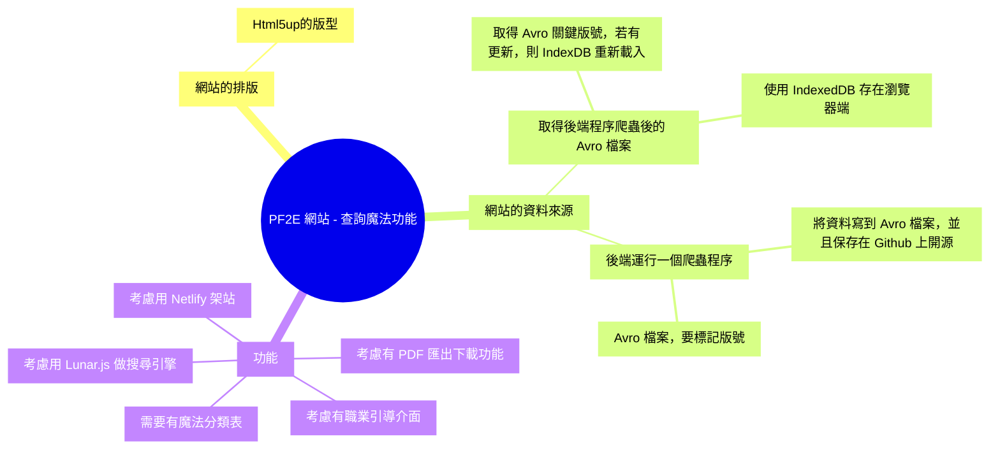

<!-- 概念圖 -->

<!--
https://bojne.medium.com/%E4%B8%89%E6%AD%A5%E9%A9%9F%E7%94%A8-netlify-%E8%BC%95%E9%AC%86%E6%9E%B6%E7%B6%B2%E7%AB%99-67d65ce135f6

Get-Content .\User.avsc | dotnet avro generate | Out-File .\AvroClass\User.cs

-->